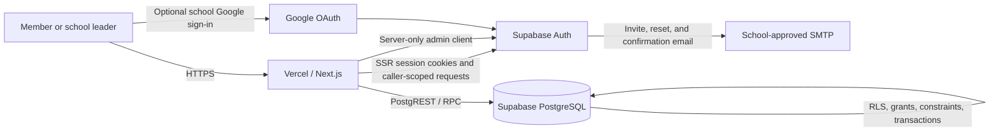

# NHS Service Hours Portal — Architecture

## Purpose and source of truth

This document describes the intended production architecture for the NHS Service Hours Portal and the invariants that every implementation path must preserve. The product and security decisions in `docs/DECISIONS.md` are authoritative. Database migrations are the source of truth for schema, constraints, grants, policies, and transactional functions; this document explains why those pieces exist and how they interact.

The portal is a private school record system. It is not a public volunteer directory. An authenticated identity does not receive application access merely because it can sign in: access also requires a provisioned active profile and either eligible annual member access or a global administrator grant.

## System context



### Runtime components

| Component                     | Responsibility                                                                                                                           | Security boundary                                                                                                                               |
| ----------------------------- | ---------------------------------------------------------------------------------------------------------------------------------------- | ----------------------------------------------------------------------------------------------------------------------------------------------- |
| Browser                       | Render the role-aware interface, submit forms, and display only data returned for the current caller                                     | Untrusted. UI hiding is never authorization. No secret or service-level credential may enter the browser bundle.                                |
| Next.js App Router            | Server rendering, session refresh, runtime validation, authorization rechecks, mutation orchestration, CSV responses, and safe redirects | Trusted application tier. All request input and cookies remain attacker-controlled until validated.                                             |
| Supabase Auth                 | Email/password invitation acceptance, password reset, optional Google OAuth, and signed session issuance                                 | Authentication only. A valid session does not prove an active portal membership or role.                                                        |
| PostgreSQL/Data API           | Authoritative records, exact calculations, grants, Row Level Security, immutable history, and serialized workflows                       | Final data and authorization boundary. Constraints and policies must remain safe even if application code is bypassed.                          |
| Server-only Auth admin client | Invitations and other narrowly scoped Supabase Auth administration                                                                       | Highest privilege. Uses the Supabase secret key and therefore bypasses RLS; it must never inherit a user session or be imported by client code. |
| Vercel                        | TLS termination, deployment isolation, server execution, environment injection, logs, domains, and application rollback                  | Vendor/platform boundary. Preview and production must use separate environment values and preferably separate Supabase projects.                |
| Email and Google              | Delivery and optional identity-provider services                                                                                         | External boundary. Provider success does not provision authorization.                                                                           |

## Architectural invariants

1. The authenticated user ID is derived from the verified server session, never from a form field.
2. Member requests evaluate profile status, school-year dates, membership status/expiration, and current roles. Administrator requests evaluate profile status and a database-backed global grant.
3. Annual student access is `member` plus any explicitly assigned annual leadership capabilities. Global teacher-administrator access is exclusive, independent of school years, and is never inferred from a browser claim.
4. Authorization-sensitive mutations run server-side and end in a database transaction or narrowly scoped RPC.
5. Row Level Security and explicit grants deny unauthorized direct Data API access.
6. Selected committee head, completed first approval, and final teacher reviewer are separate facts. Hours require both approval stages.
7. Only approved requests contribute to the fixed 20-hour requirement. Pending hours are a separately colored adjacent visual/text value; changes-requested hours remain separate.
8. Reviews, corrections, and audit events are append-only. Approved facts are never silently overwritten.
9. Historical identities and records survive school-year expiration, suspension, and transition.
10. Exactly one active global administrator is platform owner. Role preview is synthetic and read-only; it never impersonates a real account.
11. Sensitive responses and pages are private and must not enter shared caches.

These invariants implement the choices recorded in `docs/DECISIONS.md`, especially D-003 through D-011.

## Application layers

### Presentation layer

The App Router supplies public authentication pages, member pages, leader queues and roster pages, and teacher-administrator settings. Server Components should fetch protected data directly through the server data-access layer. Client Components are limited to browser interaction that actually requires state, effects, or event handlers.

Role-aware navigation is a convenience. A hidden link does not make its destination safe; the destination and every invoked mutation repeat authorization on the server.

The visual and interaction contract is defined in `docs/DESIGN_SYSTEM.md`. In particular, statuses use icon plus text, approved progress has a text equivalent, and responsive tables become understandable mobile records rather than unreadable compressed grids.

### Domain layer

Pure TypeScript domain functions own deterministic behavior that does not require identity or I/O:

- exact quarter-hour validation and decimal-safe progress calculations;
- school-year and membership date eligibility;
- role combination and review-capability checks;
- hour-request state transitions;
- self-review rejection;
- invitation and query-filter validation;
- CSV field escaping and spreadsheet-formula neutralization; and
- stable audit action/event types.

This layer is unit-tested without Supabase or a browser. It does not replace database constraints or RLS.

### Server authorization and data-access layer

The server layer performs the following sequence for protected work:

1. Create a caller-scoped Supabase server client from the request cookies.
2. Verify identity using a server-validated claim/user API; do not authorize from an unverified client session object.
3. Load the provisioned profile, global grant, and relevant memberships.
4. Evaluate the appropriate global-administrator or annual member/reviewer requirement.
5. Validate and normalize the request with a runtime schema.
6. Call a typed query or one transactional RPC.
7. Return a minimal view model or redirect to a same-origin path.

The Supabase secret key is reserved for operations that cannot use caller-scoped RLS, principally Auth administration. Normal application data reads and writes should use the caller-scoped client so RLS remains active.

### Database layer

PostgreSQL stores normalized identities, global platform-access grants, school years, memberships, roles, categories, requests, reviews, corrections, invitations, settings, and audit events. The ordered files in `supabase/migrations` define the current schema, restricted functions, security-invoker views, explicit grants, and forced RLS.

The `member_progress`, `pending_review_queue`, `category_totals`, `school_year_summary`, and `export_service_records` views expose calculated/reporting shapes with caller semantics. They still require tests under `anon`, ordinary authenticated, leader, expired-leader, and teacher-administrator contexts.

### Implementation map

| Concern                                            | Current implementation boundary                                                                                                                  |
| -------------------------------------------------- | ------------------------------------------------------------------------------------------------------------------------------------------------ |
| Session refresh and CSP                            | `src/proxy.ts`                                                                                                                                   |
| Global response headers                            | `next.config.ts`                                                                                                                                 |
| Runtime environment validation                     | `src/lib/env.ts` and `.env.example`                                                                                                              |
| Caller/browser/elevated Supabase clients           | `src/lib/supabase/server.ts`, `src/lib/supabase/browser.ts`, `src/lib/supabase/admin.ts`                                                         |
| Viewer, membership, and role gates                 | `src/lib/dal/access.ts`                                                                                                                          |
| Caller-scoped reads and view mapping               | `src/lib/dal/portal.ts`                                                                                                                          |
| Auth, member, review, and administration mutations | `src/app/actions/auth-actions.ts`, `src/app/actions/hour-actions.ts`, `src/app/actions/review-actions.ts`, `src/app/actions/admin-actions.ts`    |
| OAuth, invite, and recovery confirmation           | `src/app/auth/callback/route.ts`, `src/app/auth/confirm/route.ts`, `src/app/auth/recovery-callback/route.ts`, `src/lib/auth/claim-invitation.ts` |
| Password-update proof                              | `src/lib/auth/password-update-context.ts`, `src/app/(auth)/update-password/page.tsx`, `src/app/actions/auth-actions.ts`                          |
| Auth email templates                               | `supabase/templates/invite.html`, `supabase/templates/recovery.html`, `supabase/config.toml`                                                     |
| Same-origin redirect validation                    | `src/lib/safe-navigation.ts`                                                                                                                     |
| Authorized paginated CSV route                     | `src/app/api/exports/[type]/route.ts`                                                                                                            |
| Pure business rules                                | `src/lib/domain`                                                                                                                                 |
| Database integrity/authorization                   | Ordered SQL under `supabase/migrations`                                                                                                          |
| Synthetic local data                               | `supabase/seed.sql`                                                                                                                              |
| Database/browser tests and CI                      | `supabase/tests`, `tests/e2e/portal.spec.ts`, `tests/e2e/design-preview.spec.ts`, `playwright.config.ts`, `.github/workflows/ci.yml`             |

## Primary data flows

### Invitation and first sign-in

1. A teacher administrator submits an email, name, school year, and one initial access choice from Accounts → Add accounts.
2. The server validates the allowed email domain and verifies a global administrator grant. The database separately validates the target school year and normalizes Committee head or President / Vice President to include member. Teacher administrator must be exclusive and requires the platform owner.
3. `create_invitation` records the pending business record and proposed roles with `send_count = 0` and `sent_at = null`; no invitation secret is stored.
4. `prepare_invitation_send` rechecks the caller's global grant and that the invitation is still pending in an open year, then returns only the email/name/ID needed by the server-only Auth call.
5. The server calls Supabase Auth Invite User with the exact invitation ID and a non-secret `invitation_send_id` UUID in Auth metadata. Only after the provider accepts the call does `record_invitation_send_success` set the seven-day expiry, increment the factual send count, and append `invitation.sent` or `invitation.resent`. The same UUID makes the database acknowledgement idempotent and correlatable; an acknowledgement failure is reported explicitly and retried with that UUID without resending the email.
6. The Invite User template sends the one-time token hash to `/auth/confirm?token_hash=…&type=invite`. The server verifies `type=invite`, claims the exact invitation (or the sole safe verified-email fallback), and creates a signed, user-bound, 30-minute HTTP-only password-update context.
7. The recovery template sends `/auth/confirm?token_hash=…&type=recovery`; `/auth/recovery-callback` is the PKCE fallback for a stock recovery template. Either route must verify fresh Auth proof before creating the same bounded password-update context. An ordinary signed-in session cannot open or submit `/update-password` without it.
8. OAuth uses the allowlisted `/auth/callback` code-exchange route. Same-origin navigation rejects absolute, scheme-relative, backslash-normalized, encoded-backslash, and control-character destinations.
9. A first-time verification/claim failure signs out and fails closed; returning users proceed only when an existing profile is visible.
10. A provisioned active member reaches the dashboard. A global administrator reaches administration even outside a school-year date range. An expired member reaches a limited account-status page; an unprovisioned or inactive identity receives no portal data.

Resending uses the same pending invitation and a fresh Auth Invite User message. It does not create a second membership or grant access by email domain alone. If Auth accepts a message but the database receipt cannot be recorded after its bounded retry, the UI reports that partial failure and tells the administrator to inspect the audit trail before another send.

### Member draft and submission

1. The member opens the form; the server returns active categories plus a deliberately minimal committee-head directory from `list_eligible_reviewers`. The directory requires the caller's active same-year membership, excludes the caller and all teachers, returns only eligible committee-head membership/profile IDs, full name, and role keys, and exposes no email.
2. Draft input is validated. The member ID comes from the session, and protected columns such as status and reviewer identity are not accepted from arbitrary client input.
3. Draft save is limited to the owner and an eligible school year and must include the revision the member actually viewed.
4. Submission validates the expected revision, category activity, service date, positive quarter-hour hours up to 24, active committee-head eligibility, and school-year acceptance.
5. One database transaction changes the request to `pending`, records submission time and the selected first approver, clears any prior approval stages on resubmission, and appends an audit event.

### Two-stage review, changes, rejection, and reassignment

1. While no committee-head approval is recorded, only the active committee head selected by the member can decide the request. A teacher may reassign a legacy/stale first-stage assignment to another active committee head but cannot approve it.
2. Committee-head approval appends immutable `committee_approved` history, keeps status `pending`, and makes the request visible to every active teacher administrator.
3. During the teacher stage, any teacher can approve, request changes, or reject. Only teacher approval changes status to `approved` and credits the hours.
4. Changes requested and rejection require a comment. Resubmission clears both acting-reviewer fields and restarts with the currently selected committee head.
5. Every decision transaction locks the row, rechecks stage and authority, rejects self-review, and records the acting membership. Competing final teacher transactions cannot both succeed.

### Approved-record correction

Approved records are locked in ordinary edit paths. A teacher administrator supplies a correction reason and intended before/after fields. One protected transaction verifies authority, captures the old values, records a correction event and audit event, then applies the allowed corrected values. The original facts remain recoverable from the correction record.

### Progress and reporting

Progress is calculated from authoritative request rows, not stored as a mutable total:

```text
actual percentage = approved hours / 20 * 100
remaining hours   = max(20 - approved hours, 0)
hours over goal   = max(approved hours - 20, 0)
```

The UI renders approved from the left, pending immediately after it, and neutral remainder on the same track. Visual width is capped at 100 percent, but text always shows the true approved percentage, pending hours, and over-goal hours. Pending never changes the approved-hours remainder.

### Platform-owner role preview

The single platform owner can open fixed Member, Committee head, President / Vice President, and Teacher administrator screen fixtures. The server authorizes the owner before rendering; the fixtures contain synthetic constants, do not load a target user's records, and disable hosted content interactions. This is demonstration, not impersonation: every real mutation continues to derive the signed-in actor from the session.

### CSV export

1. The server verifies an active global teacher-administrator grant.
2. A caller-safe query/view returns only the requested authorized dataset in deterministic pages so the Data API row limit cannot silently truncate a file.
3. The serializer quotes fields, normalizes line endings, and neutralizes spreadsheet formula control prefixes.
4. The response uses an attachment content disposition, UTF-8 CSV content type, and private/no-store caching.
5. The export action, format, and final row count are written to the audit trail; the CSV file itself is not retained by the app. Complete service exports include the newest non-null reviewer comment as `latest_review_comment`.

## Trust boundaries and abuse cases

| Boundary                           | Representative threat                                                                             | Required control                                                                                                       |
| ---------------------------------- | ------------------------------------------------------------------------------------------------- | ---------------------------------------------------------------------------------------------------------------------- |
| Browser → Next.js                  | Forged IDs, statuses, roles, hours, redirects, or form replays                                    | Runtime validation, identity from session, safe relative redirects, idempotency/state checks, and server authorization |
| Next.js → Supabase Data API        | Application bug or bypassed UI exposing another student's data                                    | Least-privilege grants, RLS, security-invoker/caller-safe views, and database constraints                              |
| Next.js → Auth admin API           | Secret-key disclosure or overbroad admin function                                                 | `server-only` module, environment secret, narrow function surface, audit, no user-session inheritance                  |
| OAuth/email → callback             | Open redirect, forged/unprovisioned identity, expired token, or arbitrary-session password change | Exact redirect allowlist, token-hash/PKCE verification, provisioning check, and signed user-bound update context       |
| Concurrent reviewers → request     | Two valid terminal decisions                                                                      | Row lock plus current-state predicate in one transaction                                                               |
| CSV → spreadsheet                  | Formula execution when an administrator opens an export                                           | Formula neutralization in addition to RFC-style CSV quoting                                                            |
| Logs/analytics → operators/vendors | Student data or secrets copied into telemetry                                                     | Structured redaction, no request bodies/cookies/tokens, no third-party analytics by default                            |
| Preview → production               | Preview using production student data or credentials                                              | Separate Supabase projects/keys, protected previews, environment-scoped values                                         |

## Caching and rendering rules

- Authentication pages may use ordinary public caching only when they contain no session-specific state.
- Dashboards, profiles, review queues, audit pages, and exports are dynamic and private.
- Do not apply shared `use cache`, `force-static`, or long-lived revalidation to per-user or administrative data.
- CSV and authentication responses should explicitly use `Cache-Control: private, no-store` where the framework/platform does not already guarantee it.
- No service worker may cache authenticated HTML, API responses, or exports without a separate privacy threat model.

## Availability and failure behavior

- A failed database transaction leaves no partial review, correction, invitation metadata, or audit write.
- Provider rejection leaves `sent_at` null and does not increment `send_count` or append a send audit event. A provider-accepted/database-receipt failure is surfaced separately for audit reconciliation before retry.
- If Supabase is unavailable, the UI returns a recoverable error rather than stale or fabricated progress.
- If audit insertion is part of a sensitive transaction and fails, the sensitive transaction should fail closed.
- Scheduled jobs are not required for authorization. Date and status eligibility is checked on every protected request.

## Deployment topology

Use at least two isolated environments:

| Environment | Vercel                                        | Supabase                                    | Data policy                                                         |
| ----------- | --------------------------------------------- | ------------------------------------------- | ------------------------------------------------------------------- |
| Local       | `pnpm dev`                                    | Local CLI stack from `supabase/config.toml` | Deterministic synthetic seed only                                   |
| Preview     | Branch/PR deployment                          | Dedicated non-production project            | Synthetic or deliberately anonymized data; never production secrets |
| Production  | Protected production branch and custom domain | Dedicated production project                | Real school records with restricted operator access and backups     |

Schema changes are migration-first. Validate the full migration chain locally, run database tests, dry-run the linked deployment, back up production, apply forward-compatible migrations, deploy the application, then complete smoke checks. Application rollback and database restoration are separate operations; see `docs/DEPLOYMENT.md` and `docs/OPERATIONS.md`.

## Implementation reconciliation checklist

Before release, compare this document with the final tree and migrations:

- Confirm every public, member, leader, and teacher-administrator route has a corresponding server authorization path.
- Confirm the generated database types match the current migrations.
- Confirm the actual RPCs serialize review and correction transitions as described.
- Confirm every exposed view is caller-safe and tested with RLS.
- Confirm all environment variable names match the checked-in example file.
- Confirm the production and preview deployment topology is recorded with real project owners, not secrets.
- Replace any design-intent language with verified implementation details only after the relevant file and test exist.
