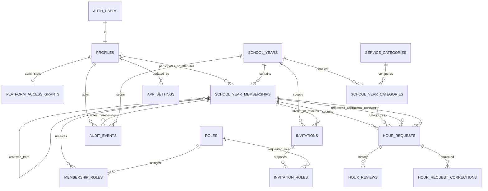
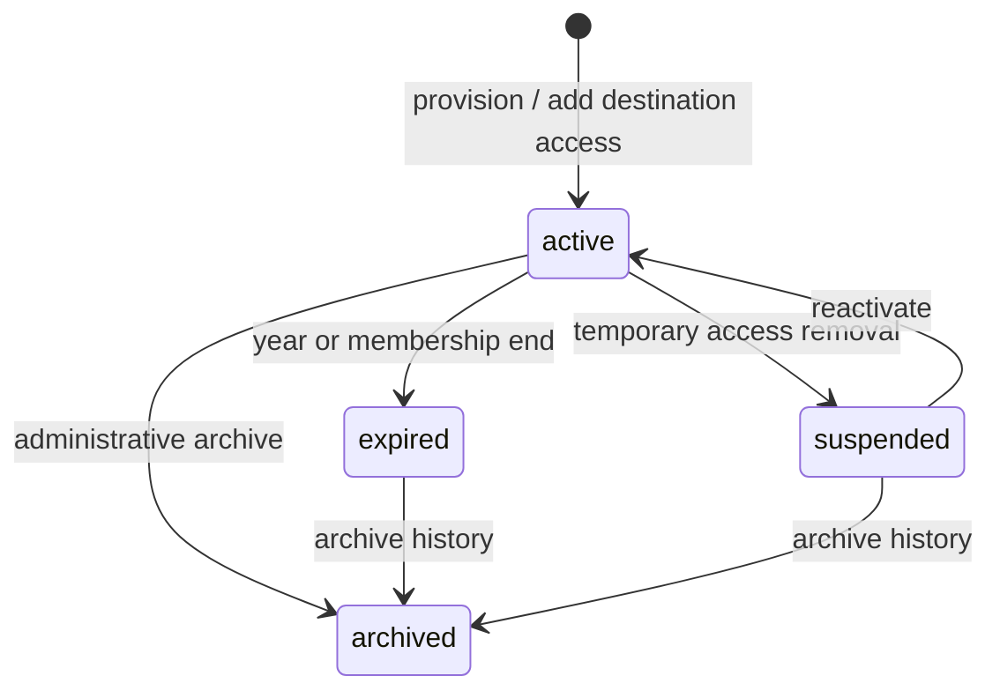
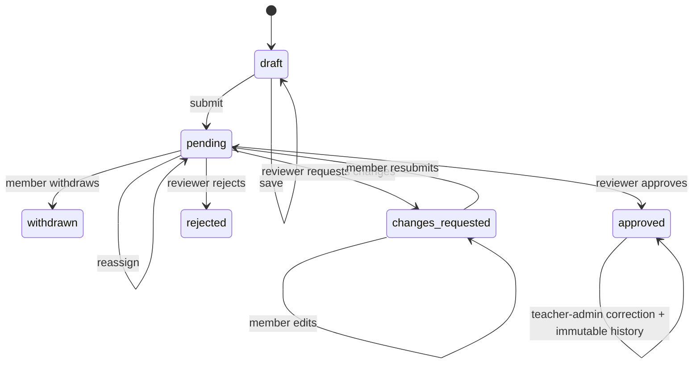

# NHS Service Hours Portal — Data model

## Source of truth and conventions

The ordered SQL files under `supabase/migrations` are the source of truth for tables, constraints, indexes, triggers, functions, views, grants, and Row Level Security. The initial schema is defined in `supabase/migrations/20260829030000_initial_nhs_backend.sql`. This document describes that model for developers and school operators; it does not replace the SQL.

The model deliberately separates a persistent person, global staff administration, and year-scoped member access:

```text
Supabase Auth user → profile ─┬→ optional global platform-access grant
                              └→ school-year membership → member/leadership roles
```

Common conventions:

- primary identifiers are UUIDs, except fixed role IDs and append-only history/event IDs;
- timestamps use `timestamptz`; calendar/service/expiration boundaries use `date`;
- names and emails that need case-insensitive comparison use `citext` or normalized indexes;
- hour values and targets use exact `numeric(7,2)`, never floating point;
- application records use restricted status text with check constraints;
- historical/record entities use restrictive foreign-key deletion and archive/deactivate workflows; and
- authorization-sensitive functions set an empty `search_path`, derive the actor from `auth.uid()`, and qualify database objects.

The hosted database timezone should remain UTC. The UI may localize timestamps, but school-year and service-date eligibility compares calendar dates consistently.

## Relationship map



Several relationships intentionally repeat `school_year_id` and use composite foreign keys. This makes same-year requirements structural rather than relying only on application checks—for example, a request's member and requested/actual reviewer memberships must belong to the request's school year.

## Entity catalogue

### `profiles`

One operational profile per `auth.users.id`.

Important fields: case-insensitive unique `email`, `full_name`, `status` (`active` or `inactive`), deactivation actor/time, and created/updated timestamps. An active profile has no deactivation timestamp; an inactive one must have one. Auth credentials remain in Supabase Auth and are never duplicated here.

Profiles persist through school-year transitions so historical service and decisions remain attributable. Deactivate instead of hard-delete.

### `platform_access_grants`

At most one row per profile grants global `teacher_admin` or `platform_owner` access. A partial unique index permits exactly one current platform owner once administration is bootstrapped. Grant actor/time are retained for attribution.

Global authority requires an active profile but is independent of school-year dates, status, and member requirements. Only the platform owner can grant/revoke teacher-administrator access or transfer ownership. Global administrators are prohibited from member or student-leadership roles; a separate teacher-only membership anchor is maintained per year solely because review and audit history use same-year membership foreign keys.

### `school_years`

Defines an administrative period with case-insensitive unique `label`, inclusive start/end dates, fixed 20-hour default target, status (`draft`, `active`, `closed`, `archived`), creator, timestamps, and closure actor/time.

An active year accepts service work only while the database calendar date is inside its date range. Closed/archived years retain history. The application validator additionally expects a consecutive-year label such as `2026-2027`.

### `school_year_memberships`

Connects a member/student leader to one school year. Important fields are `status` (`active`, `expired`, `suspended`, `archived`), `expiration_date`, optional historical transition link, creator, status-change time, and timestamps. The nullable target-override column remains for compatibility but is always null under the fixed policy.

Key invariants:

- unique `(profile_id, school_year_id)`;
- expiration falls within the referenced year;
- a renewal references the same profile in a different year;
- target override is always null and member progress uses 20; and
- active authority also requires an active profile, active/in-range school year, and unexpired membership.

Changing a row's status updates `status_changed_at`. Renewal creates a new row; it never rewrites the old year's membership. Expired memberships and memberships in closed or archived years are read-only history: they cannot be reactivated or have annual roles assigned or removed. Continued participation must use destination-year access.

### `roles` and `membership_roles`

`roles` contains the fixed keys:

| Key                        | Review capable | Purpose                                           |
| -------------------------- | -------------- | ------------------------------------------------- |
| `member`                   | No             | Annual service participation                      |
| `committee_head`           | Yes            | Annual member leadership                          |
| `president_vice_president` | Yes            | Combined annual President / Vice President choice |
| `teacher_admin`            | Yes            | Technical attribution anchor for a global grant   |

`membership_roles` is the many-to-many assignment table with assignment actor/time and primary key `(membership_id, role_id)`. Committee head and President / Vice President include the baseline member role. Global administrator anchors contain only `teacher_admin`; all other combinations with that role are rejected. Role definitions are fixed after migration.

Database triggers protect the single platform owner and final active global administrator. Ownership must transfer before the owner grant/profile can be removed or deactivated.

### `service_categories` and `school_year_categories`

`service_categories` stores the reusable name, description, active state, creator, and timestamps. A partial unique index prevents duplicate active names case-insensitively. Legacy order/request-limit columns remain but triggers normalize them to `0`/`null`.

`school_year_categories` enables a category for one year and stores availability, creator, and timestamps. Legacy order/request-limit/approved-cap columns remain but are normalized to `0`/`null` and have no policy effect.

Request hours remain exact positive quarter-hour amounts with a universal 24-hour maximum. There is no limit on how many approved hours may belong to a category. Referenced categories and year mappings are deactivated/unavailable rather than hard-deleted so old requests remain readable.

### `invitations` and `invitation_roles`

Invitation metadata includes normalized email/name, school year, status (`pending`, `accepted`, `revoked`, `expired`), expiry, inviter membership, acceptance/revocation actors/timestamps, last send time/count, and timestamps. A partial unique index permits only one pending invitation per email/year.

The application issues seven-day invitations and hosted Supabase email OTP expiry must be `604800` seconds to match. A new invitation starts with `send_count = 0` and `sent_at = null`. `prepare_invitation_send` validates the still-pending invitation without mutating those facts. After Supabase Auth accepts the Invite User call, `record_invitation_send_success` atomically sets the accepted expiry/time, increments the count, and writes `invitation.sent` or `invitation.resent`. Its UUID idempotency key prevents an acknowledgement retry from double-counting. A direct privileged RPC must not be used to create a different lifetime or fabricate provider acceptance.

`invitation_roles` records the proposed role set. No invite token, reset token, password, OAuth secret, or Auth session belongs in either table. Supabase Auth owns the secret-bearing link; the application stores status/audit metadata only.

Resend reuses one invitation and requests a new Auth invite; it advances send metadata only after provider acceptance. Acceptance maps the Auth identity to the provisioned profile/membership/roles. Domain checks supplement, but never replace, provisioning. Auth and PostgreSQL cannot share one transaction, so a provider-accepted/database-receipt failure is reported distinctly and must be reconciled before another send.

### `hour_requests`

The current service record contains:

- owner membership and school year;
- category through the year/category mapping;
- requested approver membership and actual reviewer membership as separate columns;
- title (maximum 160), description (maximum 4,000), service date, and exact hours;
- status, optional client submission/idempotency key, and monotonic revision;
- created/submitted/updated/decided/withdrawn timestamps.

Statuses are `draft`, `pending`, `changes_requested`, `approved`, `rejected`, and `withdrawn`.

Non-drafts require complete service data and a submission timestamp. Requested/actual reviewer cannot be the owner membership. Terminal/changes decisions require actual reviewer and decision time; withdrawn requires withdrawal time; a draft has no submission time. Hours are 0.25–24.00 in quarter-hour increments.

The row-protection trigger rejects deletion, requires authorized functions for creation/status/protected-field changes, and prevents ordinary changes to approved records. `revision` and the optional member/client-key unique index support stale-write and replay protection.

### `hour_reviews`

Append-only workflow history. Each event references the request/year, actor membership, reviewer membership when applicable, previous/new status, previous/new requested approver, optional bounded comment, and timestamp.

Actions are:

- member actions: `submitted`, `resubmitted`, `withdrawn`;
- reviewer actions: `approved`, `changes_requested`, `rejected`, `reassigned`; and
- teacher-admin history action: `corrected`.

Changes-requested and rejection comments are mandatory. Trigger validation aligns actor/reviewer with the request and prevents self-review. Updates and deletes are rejected.

### `hour_request_corrections`

Append-only correction ledger for an approved request. It records correcting teacher-admin membership, required reason, structured `before_values`, structured `after_values`, and timestamp. Before/after must differ; update/delete is rejected.

The current approved row changes only inside the correction transaction, which also writes correction, review, and audit history.

### `audit_events`

Append-only administrative/security event stream. Fields include event time, optional actor profile/membership, dotted action name, entity type and stable ID, optional school-year scope, structured old/new values, and structured metadata.

The audit trail attributes the business action; it is not a request-body log. Never put credentials, invitation/reset tokens, cookies, entire CSV rows, or unnecessary free-text student data into the JSON fields. Update/delete is rejected.

### `app_settings`

Small typed-by-convention JSON settings registry with key, value, description, updater, and timestamps. The migration establishes `public_signup_enabled=false` as defense in depth and an optional `allowed_email_domains` array. Hosted Supabase Auth settings and server environment checks remain independent controls.

Do not use this table for secrets. New settings need explicit schema validation, authorization, audit, and documented defaults.

## Deterministic local reference data

`supabase/seed.sql` creates synthetic Auth/profile personas covering member, Committee head, combined President / Vice President, global platform owner, an expired ordinary member, and an expired former leader. The platform owner has teacher-only attribution anchors and no member progress. The seed also installs the five required active categories, maps them into the synthetic `2026-2027` year, and creates representative draft/pending/changes-requested/approved history.

The seed uses fixed UUIDs so database and browser tests can refer to stable actors. It contains no login-capable password hash: the loopback-restricted E2E preparer assigns the shared synthetic password through the running Auth admin API. The fixture is recreateable, contains no real student data, and must never be pushed with `supabase db push --include-seed` to a hosted environment. Local login details are documented in `docs/OPERATIONS.md`.

## State and lifecycle model

### Membership lifecycle



Security never depends on a scheduled transition. Even if a member row still says `active`, member authority fails after the year end or expiration date. A new year's access is a new membership linked through `renewed_from_membership_id`. This lifecycle does not govern global administrator grants.

### Request lifecycle



Rejected and withdrawn are terminal in the current workflow. Only a pending request can receive a reviewer decision. Reassignment leaves it pending. A database transaction locks and rechecks the row for review/reassignment/correction.

## Transactional public API

Ordinary writes use caller-authenticated functions rather than direct protected-column changes:

| Function                    | Actor and effect                                                                                                             |
| --------------------------- | ---------------------------------------------------------------------------------------------------------------------------- |
| `create_hour_request_draft` | Active member creates an owned draft, optionally with partial validated fields and client key                                |
| `save_hour_request_draft`   | Owner saves editable draft/changes-requested content only when the expected revision still matches                           |
| `submit_hour_request`       | Owner validates complete data and expected revision, then moves draft/changes-requested to pending with review/audit history |
| `withdraw_hour_request`     | Owner moves eligible pending request to withdrawn with history/audit                                                         |
| `review_hour_request`       | Active review-capable non-owner locks pending request and approves, requests changes, or rejects                             |
| `reassign_hour_request`     | Active review-capable non-owner changes requested assignment while preserving pending state/history                          |
| `correct_approved_request`  | Active teacher admin changes approved service facts with reason, before/after correction, review, and audit                  |

Administrative functions follow the same actor-derived pattern:

| Function                                                                 | Actor and effect                                                                                                                                                                               |
| ------------------------------------------------------------------------ | ---------------------------------------------------------------------------------------------------------------------------------------------------------------------------------------------- |
| `bootstrap_teacher_admin`                                                | Service-role-only, serialized one-time creation of the first profile, global platform-owner grant, year, teacher-only attribution anchor, and audit event                                      |
| `create_school_year`, `activate_school_year`, `close_school_year`        | Global teacher-admin year lifecycle; new years automatically receive attribution anchors                                                                                                       |
| `set_school_year_target`, `set_membership_target`                        | Compatibility contracts that accept only fixed policy (`20` and `null`, respectively)                                                                                                          |
| `renew_memberships`                                                      | Destination-year creation/reactivation for non-global profiles, fixed year-end expiration, fixed target, normalized member/leadership roles, transition links, and audit                       |
| `set_membership_status`, `set_profile_status`                            | Teacher-admin lifecycle changes with global-grant protections and audit; historical annual access cannot be reactivated                                                                        |
| `assign_membership_role`, `remove_membership_role`                       | Open-year annual member/leadership assignment/removal; baseline member, global-admin exclusivity, and read-only historical roles are protected                                                 |
| `grant_teacher_admin`, `revoke_teacher_admin`, `transfer_platform_owner` | Platform-owner-only global administration with final-admin and single-owner protection                                                                                                         |
| `create_invitation`, `prepare_invitation_send`                           | Teacher-admin member/leader creation plus non-mutating eligibility/read for Auth delivery; teacher-admin invitations require the platform owner                                                |
| `record_invitation_send_success`, `revoke_invitation`                    | Idempotent provider-accepted send/expiry/count audit or protected revocation; teacher-admin invitation lifecycle actions require the platform owner                                            |
| `claim_invitation`                                                       | Authenticated invitee claims an explicit invitation ID, or the sole eligible pending invitation for their verified email; creates/reactivates membership and assigns proposed roles atomically |
| `upsert_service_category`, `set_school_year_category`                    | Teacher-admin category identity/state and year availability; obsolete order/cap arguments are neutralized                                                                                      |
| `set_app_setting`                                                        | Teacher-admin update to an allowlisted non-secret setting                                                                                                                                      |
| `record_export`                                                          | Teacher-admin-only audit event for a bounded export result                                                                                                                                     |
| `list_eligible_reviewers`                                                | Minimal directory for an active same-year member: eligible reviewer membership/profile IDs, full name, and role keys; caller and email excluded                                                |

`prepare_invitation_send(uuid)` returns only `(invitation_id uuid, email text, full_name text)` after rechecking current teacher-admin authority and invitation/year state. `record_invitation_send_success(uuid, uuid, timestamptz)` returns the updated `invitations` row and classifies the first accepted send as `invitation.sent` and later accepted sends as `invitation.resent`. The per-send UUID is carried as non-secret Auth metadata (`invitation_send_id`) and stored as audit metadata (`send_idempotency_key`) for reconciliation; a partial unique audit index enforces one receipt per invitation/key. The removed pre-provider `resend_invitation` function must not be reintroduced.

All function arguments are data to validate, not authority. Except for the service-role bootstrap, the actor membership is derived from `auth.uid()` and current database state. Public execution grants are broader than effective authority by design: every security-definer function must fail closed internally for an ineligible caller.

## Derived data and reporting

The migration defines five `security_invoker` views so underlying table RLS remains active:

| View                     | Purpose                                                                                                                                                                    |
| ------------------------ | -------------------------------------------------------------------------------------------------------------------------------------------------------------------------- |
| `member_progress`        | Fixed 20-hour target, member/leadership roles, status totals, remaining/over-goal hours, last activity, and uncapped approved percentage; global admins excluded           |
| `pending_review_queue`   | Pending service details, member/category/requested-reviewer context, assignment-to-current-user flag, and pending age                                                      |
| `category_totals`        | Approved/pending totals per membership/category; compatibility cap/remaining columns are null                                                                              |
| `school_year_summary`    | Membership and request counts plus approved/pending totals by school year                                                                                                  |
| `export_service_records` | Teacher-admin-filtered service rows with stable IDs, member/category/reviewer context, status, revision, newest non-null `latest_review_comment`, and lifecycle timestamps |

Roster progress is a school-year-filtered query over `member_progress`; authorized membership-directory exports use the caller-safe membership/profile/progress sources. Pagination and search remain bounded in the server data-access layer.

For each member membership, the target is fixed at 20 approved hours:

```text
approved_hours          = sum(hours where status = approved)
pending_hours           = sum(hours where status = pending)
changes_requested_hours = sum(hours where status = changes_requested)
remaining_hours         = max(20 - approved, 0)
over_goal_hours         = max(approved - 20, 0)
actual_percentage       = approved / 20 * 100
```

The UI stacks approved then pending on one track and caps the combined visual width at 100%; query/text values preserve real approved and pending totals. Pending never contributes to approved completion. There are no per-category approved-hour caps.

## RLS and grants model

All exposed application tables have RLS enabled and forced. `anon` receives no application-table access. `authenticated` receives only the minimal table/view/function privileges needed for policies and public RPCs. Because policy expressions execute in the caller's context, authenticated users receive `USAGE` on the non-exposed `private` schema and `EXECUTE` on exactly the read-only predicate helpers referenced by policies/views; all other private functions remain revoked.

Policy intent:

| Data                               | Member                                | Active student reviewer                                      | Global teacher admin                                             | Platform owner                            |
| ---------------------------------- | ------------------------------------- | ------------------------------------------------------------ | ---------------------------------------------------------------- | ----------------------------------------- |
| Own profile/memberships/roles      | Read                                  | Read own plus permitted roster context                       | Read permitted directory/history                                 | Same as admin                             |
| Other profiles/memberships/roles   | Denied                                | Read when role is currently eligible for that school year    | Read/manage through protected workflows                          | Same as admin plus global grants          |
| Categories/years                   | Read authorized configuration/history | Read authorized configuration/history                        | Manage through protected workflows                               | Same as admin                             |
| Own requests/reviews/corrections   | Read; mutate only through member RPCs | Read                                                         | No member-owned requests; review/correct with attribution anchor | Same as admin                             |
| Other requests/reviews/corrections | Denied                                | Read/review permitted school-year records; never self-review | Read/review/correct                                              | Same as admin                             |
| Invitations                        | Denied                                | Denied                                                       | Member/leader invitations                                        | Also teacher-admin invitations            |
| Audit/settings/exports             | Denied                                | Denied unless explicitly required                            | Restricted read/manage/export                                    | Same as admin plus read-only role preview |

Membership eligibility helper functions include profile status, membership status/expiration, school-year status/date, and role. Database tests must impersonate each actor and prove both allow and deny behavior, including through every view and public function.

## Immutability and deletion policy

- `hour_reviews`, `hour_request_corrections`, and `audit_events` reject update/delete.
- `hour_requests` reject deletion; approved fields require the correction procedure.
- Profiles, years, memberships, categories/year mappings, and invitations use deactivate/archive/revoke behavior instead of hard delete.
- Roles are fixed definitions; membership assignments change.
- Foreign keys use restrictive deletion for historical attribution.

This is database integrity, not the final retention policy. Approved retention/deletion requirements may require a future audited anonymization or archival design; do not bypass triggers with ad hoc production SQL.

## Schema change procedure

1. Add a new ordered migration; never edit a migration already applied to a shared environment.
2. Use an expand/migrate/contract sequence for changes that must coexist with a running app.
3. Add constraints/indexes/policies and both allow/deny tests in the same change.
4. Reset locally from zero and run the database suite.
5. Reconcile server types/queries and this document with the final SQL.
6. Dry-run the linked hosted push, verify backup state, then apply before the compatible application deployment.

See `docs/OPERATIONS.md` for commands and rollback boundaries and `docs/QA.md` for the required database test matrix.

## Implementation reconciliation status

At documentation time, the ordered migration chain contains the core/admin functions, five views, global grants, explicit privileges, and forced-RLS policies described above. `supabase/seed.sql` provides deterministic local fixtures. Eight pgTAP files declare 301 schema, workflow, RLS, admin-lifecycle, bootstrap, reviewer-directory, invitation-delivery-integrity, reviewer-name, and simplified-policy assertions (plans 63 + 51 + 37 + 9 + 20 + 48 + 13 + 60):

- `supabase/tests/001_schema_contract.sql`;
- `supabase/tests/002_workflows_and_rls.sql`;
- `supabase/tests/003_admin_lifecycle_and_authorization.sql`;
- `supabase/tests/004_bootstrap.sql`;
- `supabase/tests/005_reviewer_directory.sql`;
- `supabase/tests/006_invitation_send_integrity.sql`; and
- `supabase/tests/007_hour_request_reviewer_names.sql`; and
- `supabase/tests/008_global_admin_and_simplified_policy.sql`.

The current eight-file suite has passed dialect parsing and plan-count validation but still needs clean CI/container execution because no local Docker-compatible runtime is available. The prior seven-file/226-assertion CI pass is historical evidence for the previous schema. Release still requires:

- the documented one-time bootstrap plus protected successor-administrator workflow; and
- hosted Auth/invitation and complete paginated CSV integration checks.

The authored cases define the intended database and application-integration boundary, but the current native boundary is not established until the exact-commit CI database suite passes. Even after that pass, do not claim the production data boundary is complete until the remaining hosted and operational gates pass.
